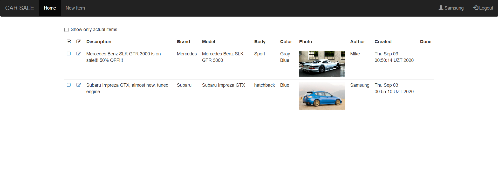
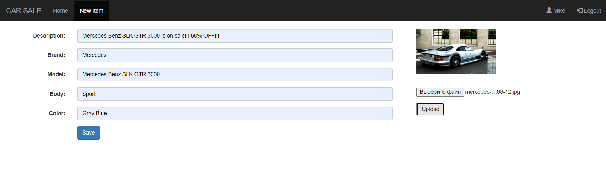
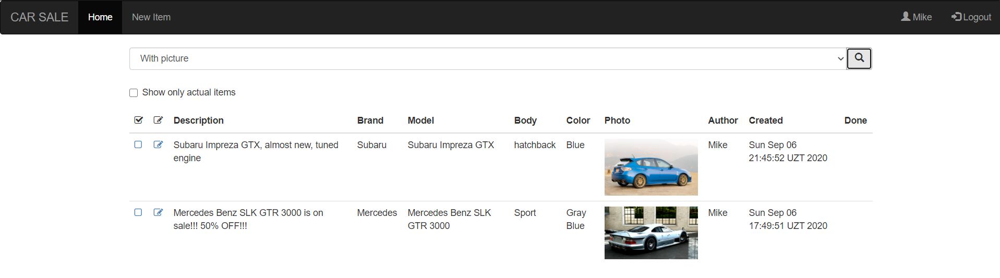
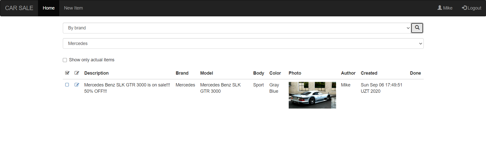

This small application is car market place application type.

  

  
  

It is example of Java EE Servlet MVC web-application with Hibernate used as ORM.
Actively used AJAX JavaScript technology and Bootstrap 3 HTML patterns.  
